# Distribution Analytics AI Agent

A sophisticated AI-powered application for querying and visualizing distribution analytics data from the Chinook music store database. This project leverages a graph-based agent architecture to process natural language queries, generate SQL, and create interactive data visualizations.

## 🌟 Features

-   **Natural Language to SQL**: Converts complex user questions into specific SQLite queries.
-   **Intelligent Query Rewriting**: Automatically refines vague queries (e.g., "show sales") into actionable requests.
-   **Agentic Workflow**: Uses [LangGraph](https://langchain-ai.github.io/langgraph/) to orchestrate a team of specialized agents (Router, Table Selector, SQL Generator, Validator, Visualization Planner).
-   **Interactive Visualizations**: Dynamically generates Vega-Lite charts when data is best suited for visual representation.
-   **Scope Guardrails**: A General Agent politely handles out-of-scope queries, guiding users back to the domain.
-   **Real-time Streaming**: Server-Sent Events (SSE) provide a real-time view of the agent's thought process and execution steps.
-   **Modern UI**: A polished, responsive React frontend built with Tailwind CSS.

## 🏗️ Architecture

```mermaid
graph TD
    User(User Query) --> Router{Query Router}
    
    Router -- Irrelevant --> General[General Agent]
    Router -- Relevant --> Rewriter[Query Rewriter]
    
    General --> End
    
    Rewriter --> TableSelector[Table Selector]
    
    TableSelector --> SQLGen[SQL Generator]
    
    SQLGen --> Validator{SQL Validator}
    
    Validator -- Invalid (Retry ≤3) --> SQLGen
    Validator -- Invalid (Max Retries) --> End
    Validator -- Valid --> Executor[SQL Executor]
    
    Executor -- Error (Retry ≤3) --> SQLGen
    Executor -- Success --> Synthesizer[Response Synthesizer]
    Executor -- Error (Max Retries) --> Synthesizer
    
    Synthesizer --> VizPlanner{Visualization Planner}
    
    VizPlanner -- No Viz Needed --> End
    VizPlanner -- Needs Viz --> VizGen[Visualization Generator]
    
    VizGen --> End
```



## 🚀 Getting Started

### Prerequisites

-   **Python**: 3.10 or higher
-   **Node.js**: 18 or higher
-   **Backend Manager**: `uv` (recommended) or `pip`
-   **Frontend Manager**: `npm` or `bun`
-   **OpenAI API Key**: You need a valid API key with access to GPT-4o.

### Installation

Clone the repository:

```bash
git clone <repository-url>
cd sql-agent-app
```

#### 1. Backend Setup

Navigate to the backend directory:

```bash
cd backend
```

Create a virtual environment and install dependencies.

Using `uv` (Fast & Recommended):
```bash
uv sync
```

Using `pip`:
```bash
python -m venv .venv
source .venv/bin/activate  # On Windows: .venv\Scripts\activate
pip install -r requirements.txt
```

Set up your environment variables:
Create a `.env` file in the `backend` directory:

```bash
touch .env
```

Add your OpenAI API key to `.env`:
```env
OPENAI_API_KEY=sk-your-openai-api-key-here
```

#### 2. Frontend Setup

Open a new terminal and navigate to the frontend directory:

```bash
cd frontend
```

Install dependencies:

```bash
npm install
# OR
bun install
```

### Running the Application

You will need to run both the backend and frontend servers simultaneously.

**Terminal 1 (Backend):**

```bash
cd backend
./run_api.sh
```
*The backend API will start at `http://localhost:8000`.*

**Terminal 2 (Frontend):**

```bash
cd frontend
npm run dev
```
*The React application will start at `http://localhost:5173`.*

## 📂 Project Structure

```
sql-agent-app/
├── backend/                # FastAPI application
│   ├── app/
│   │   ├── agents/         # Logic for specific agents (Router, SQL, Viz, etc.)
│   │   ├── graph/          # LangGraph workflow definition
│   │   ├── api/            # REST endpoints and SSE streaming
│   │   ├── tools/          # Utilities for DB access and validation
│   │   └── state/          # Global state definition
│   ├── run_api.sh          # Helper script to launch the server
│   └── requirements.txt    # Python dependencies
│
└── frontend/               # React application
    ├── src/
    │   ├── components/     # UI components (ChatInterface, TraceMonitor)
    │   ├── hooks/          # Custom React hooks (useChat)
    │   └── types/          # TypeScript interfaces
    ├── tailwind.config.js  # Styling configuration
    └── package.json        # Frontend dependencies
```
