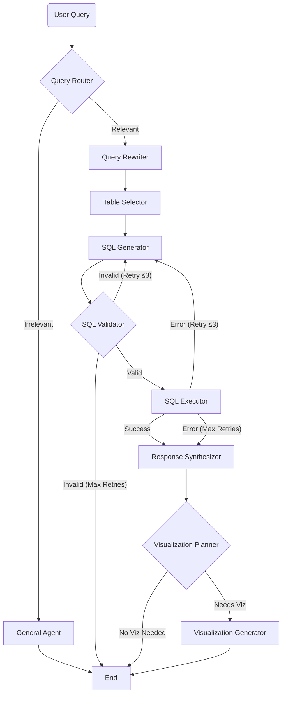

# SQL Agent Backend

Backend for the Distribution Analytics AI Agent System.

## Architecture

This application uses a graph-based agent architecture orchestrated by [LangGraph](https://langchain-ai.github.io/langgraph/). The system processes natural language queries, converts them to SQL, executes them against a SQLite database, and optionally generates visualizations.

### Agent Workflow



### Components

1.  **Query Router**: Determines if the user's query is relevant to the domain (Chinook music store).
2.  **Query Rewriter**: Refines vague user queries into specific, unambiguous questions (e.g., "sales" -> "total sales revenue by year").
3.  **Table Selector**: Identifies the relevant database tables from the schema to reduce context window usage.
4.  **SQL Generator**: Generates a valid SQLite query based on the selected schema and refined question.
5.  **SQL Validator**: Checks the generated SQL for safety (e.g., no DROP/DELETE) and syntax errors.
6.  **SQL Executor**: Runs the query against the `chinook.db` SQLite database.
7.  **Response Synthesizer**: Converts the database results into a natural language answer.
8.  **Visualization Planner**: Analyzes the data to determine if a chart is appropriate.
9.  **Visualization Generator**: Creates a Vega-Lite JSON specification for data visualization.
10. **General Agent**: Handles out-of-scope queries with helpful guidance.

## Setup

### Prerequisites

- Python 3.10+
- `uv` package manager (recommended) or `pip`

### Installation

1.  Clone the repository.
2.  Navigate to the `backend` directory.
3.  Install dependencies:

    ```bash
    uv sync
    # OR
    pip install -r requirements.txt
    ```

4.  Set up environment variables:
    Create a `.env` file in the `backend` directory and add your OpenAI API key:

    ```env
    OPENAI_API_KEY=sk-...
    ```

### Running the Server

Use the provided shell script to start the FastAPI server:

```bash
./run_api.sh
```

The API will be available at `http://localhost:8000`.
API documentation is available at `http://localhost:8000/docs`.

### Database

 The application uses a sample SQLite database (`chinook.db`) located in `app/data/`.
